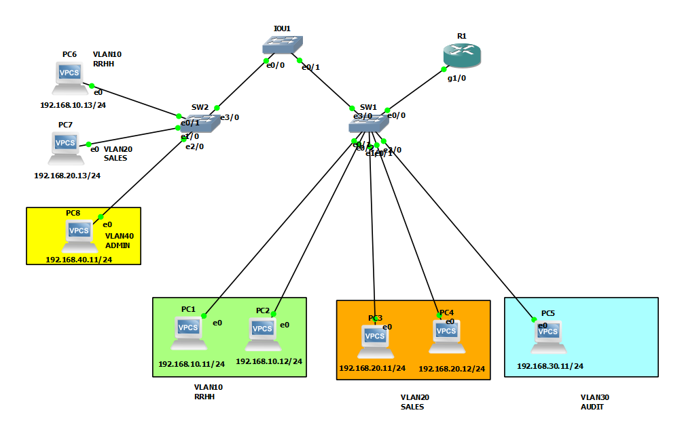
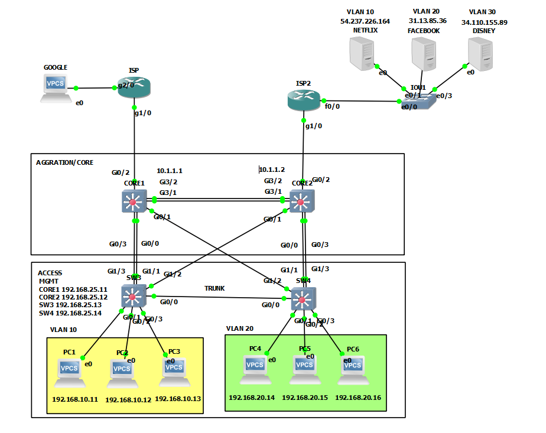
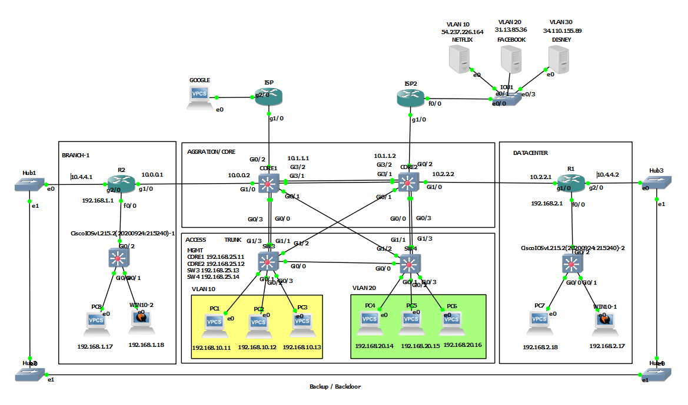

# Lab_GNs3_CISCO_CCNA
## 🛠 LABORATORIO 1 VLANS , SPANNING TREE , PROTOCOLOS CAPA2

## 🛠 Protocolos de Capa 2 (Cisco Essentials)

| Protocolo | Descripción | Comando de Desactivación (Best Practice) |
| :--- | :--- | :--- |
| **CDP** | **Descubrimiento de vecinos:** Muestra info de equipos Cisco conectados. | `no cdp run` (Global) / `no cdp enable` (Interfaz) |
| **DTP** | **Negociación de Trunks:** Negocia automáticamente enlaces troncales. | `switchport nonegotiate` |
| **ISL** | **Encapsulado VLAN:** Alternativa propietaria a 802.1Q (Obsoleta). | `switchport trunk encapsulation dot1q` |

---
> **Nota de Seguridad:** Se recomienda desactivar **DTP** y **CDP** en interfaces que conectan a dispositivos finales (PCs) para evitar fugas de información y ataques de VLAN Hopping.

## 🛠 LABORATORIO 2  PORT CHANNEL, SSH, HARDENING

## 🛠 LABORATORIO 3  ENRUTAMIENTO ESTATICO

